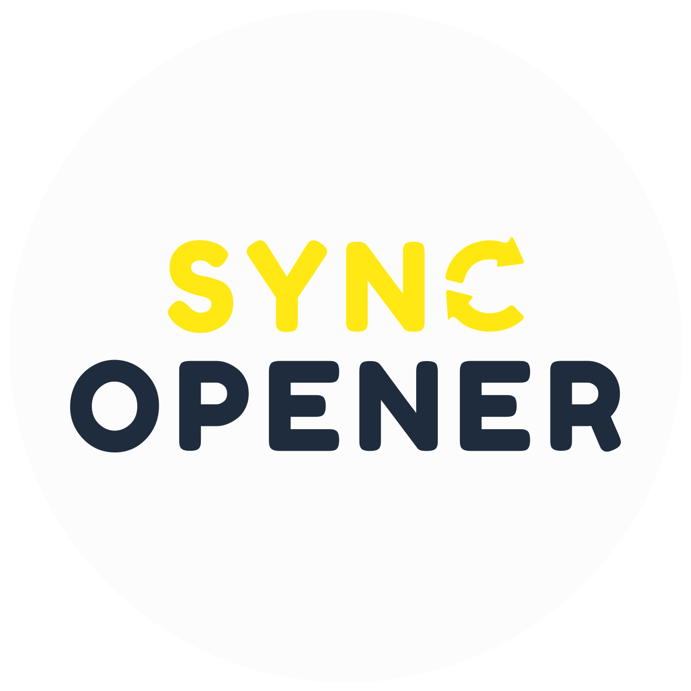
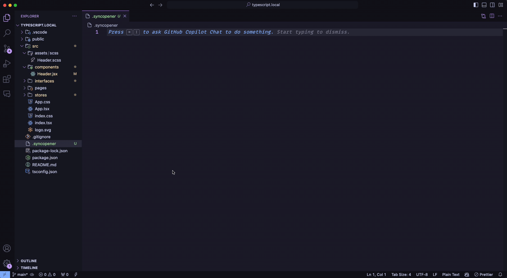
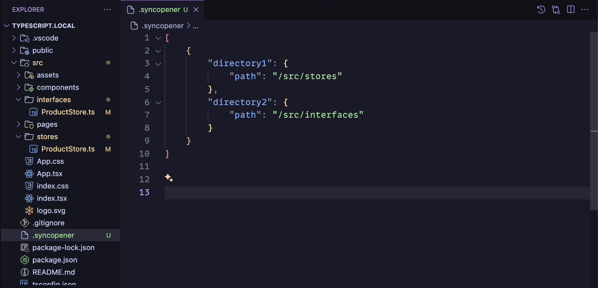
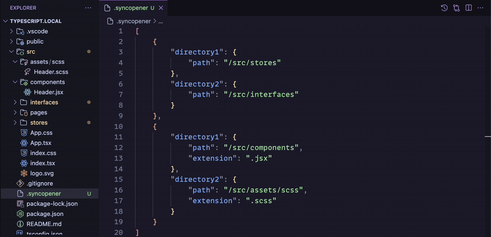

<h3 align="center">
	
	<br/>
	<br/>
</h3>

<h3 align="center">
	Enhance your coding efficiency with SyncOpener, a Visual Studio Code extension designed to streamline your workflow. This tool automatically detects and opens related files across different directories based on your predefined settings. Perfect for projects with files that have mirror or counterpart versions in various locations, SyncOpener ensures you can effortlessly switch between file pairs with different extensions. Simplify your development process by keeping essential files in sync and readily accessible, all within your coding environment.
	<br/>
	<br/>
</h3>

<p align="center">
	
</p>


## Features

- **Automatic File Detection:** Opens related files based on the configurations specified in the `.syncopener` file.
- **Support for Multiple Extensions:** Works with a variety of file extensions including `.ts`, `.tsx`, `.js`, `.jsx`, `.html`, `.css`, and `.scss`.
- **Workspace Integration:** Seamlessly integrates with your Visual Studio Code workspace, supporting projects with multiple directories.


## Getting Started

### Installation

To install SyncOpener, follow these steps:

1. Open Visual Studio Code.
2. Navigate to the Extensions view by clicking on the square icon on the sidebar or pressing `Ctrl+Shift+X`.
3. Search for "SyncOpener".
4. Click on the install button next to the extension.


## Configuration

To configure SyncOpener, you need to create a `.syncopener` file in the root of your workspace. This JSON-formatted file specifies pairs of directories to sync and optional specific extensions for the files within those directories.

#### `.syncopener` File Format

The `.syncopener` file should contain an array of objects, each representing a pair of directories. Here’s the format you should follow:

```json
[
    {
        "directory1": {
            "path": "/path/to/first/directory",
            "extension": ".js"
        },
        "directory2": {
            "path": "/path/to/second/directory",
            "extension": ".ts"
        }
    },
    {
        "directory1": {
            "path": "/path/to/third/directory"
        },
        "directory2": {
            "path": "/path/to/fourth/directory"
        }
    }
]
```


- **path:**
The relative path from the root of the workspace to the directory.

- **extension (optional):** 
If specified, the extension transformation will apply when switching between files in these directories. This is useful when working on Front-End styling. For example: link the initial directory with ".jsx" extension and the second directory as ".scss" and it will open the files simulatenously. **Files must be called the same other than the extension.**


## Examples

For files with the same extension the `extension` can be omitted. This can be seen here:

<p align="center">
	
</p>


For files with different extensions (e.g .jsx and .scss) define the `extension` for both files in the JSON like below:

<p align="center">
	
</p>


## Usage

Once SyncOpener is installed and configured, simply open a file that matches the criteria in your `.syncopener` configuration. SyncOpener will automatically detect and open the corresponding file in the paired directory, allowing you to work across files seamlessly.


## License

Distributed under the MIT License. See `LICENSE` for more information.
